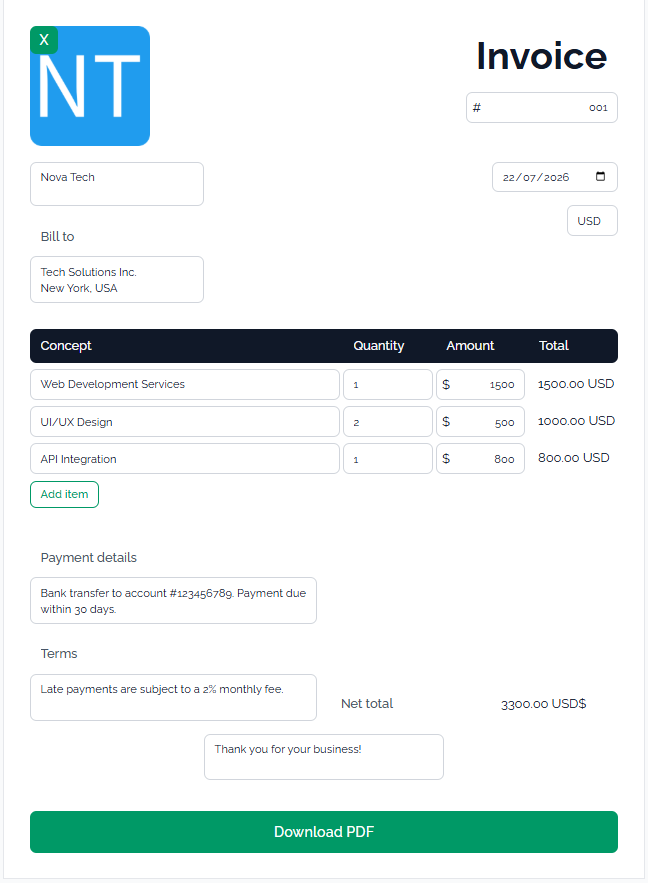
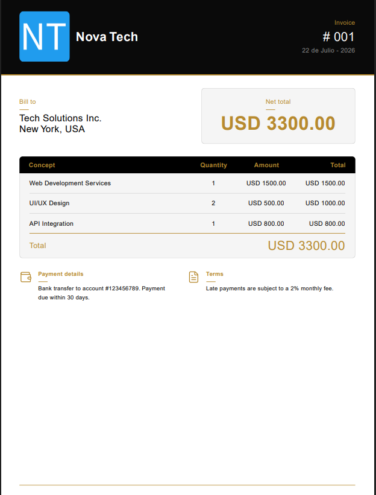

# My Invoice

Web application for creating and downloading fully customizable invoices in PDF format. All fields are editable, supports dynamic item management, custom logo upload, and two currencies (USD and USDT).

## 🚀 Tech Stack

- **Framework:** React 19 + TypeScript
- **Build Tool:** Vite
- **Styles:** TailwindCSS
- **Forms:** React Hook Form
- **PDF Generation:** React PDF
- **Notifications:** React Toastify

## ⚙️ Setup

### Prerequisites

- [Node >=24](https://github.com/nvm-sh/nvm)

### Installation

1. Run `npm ci` to install dependencies

## ▶️ How to Run

```bash
# Development
npm run start:dev

# Production (build first)
npm run build
npm run preview
```

### Code Quality

```bash
# Lint and fix
npm run lint

# Format code
npm run format
```

## 📸 Screenshots

<table>
  <tr>
    <td></td>
    <td valign="top"></td>
  </tr>
</table>

## 📁 Project Structure

```
src/
├── features/         # Feature modules
│   ├── invoice/      # Invoice form and logic
│   └── pdf/          # PDF generation
├── interfaces/       # Global TypeScript interfaces
├── pages/            # Route pages
└── services/         # Global services
```

## 🛠️ Recommended Tools

- [ESLint](https://marketplace.visualstudio.com/items?itemName=dbaeumer.vscode-eslint)
- [Prettier](https://marketplace.visualstudio.com/items?itemName=esbenp.prettier-vscode)
- [EditorConfig](https://marketplace.visualstudio.com/items?itemName=EditorConfig.EditorConfig)

## 👤 Author

| [<br><sub>Javier Anibal Villca</sub>](https://github.com/Javier104-dev) |
| :------------------------------------------------------------------------------------------------------------------------------------------------: |
